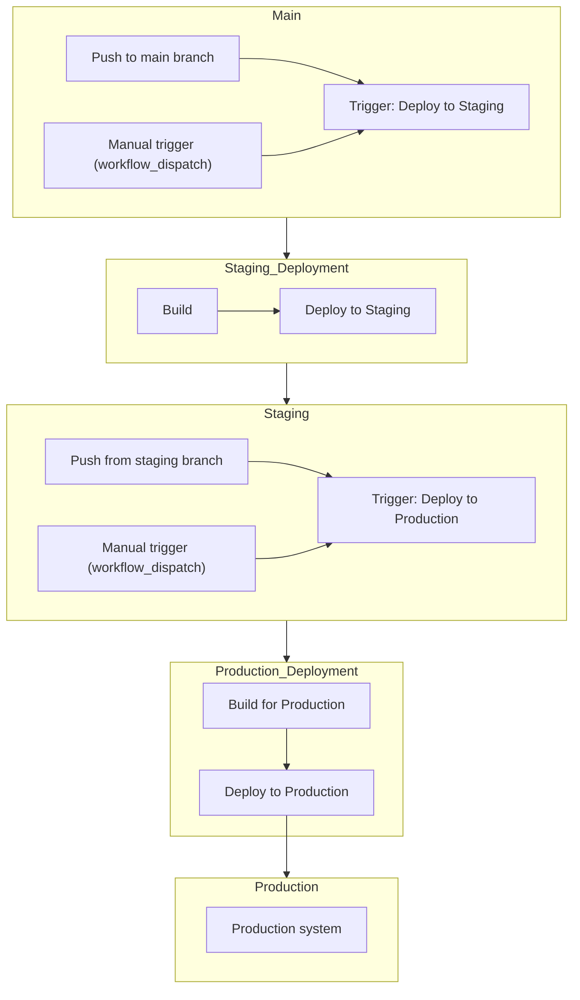

```mermaid
flowchart TD
 subgraph Trigger [Main]
        T1["Trigger: Deploy to Staging"]
        A1["Push to main branch"]
        A2["Manual trigger (workflow_dispatch)"]
  end
 subgraph Staging_Deployment["Staging_Deployment"]
        B1["Build"]
        B2["Deploy to Staging"]
  end
 subgraph Trigger_Prod [Staging]
        C1["Push from staging branch"]
        C2["Manual trigger (workflow_dispatch)"]
        T2["Trigger: Deploy to Production"]
  end
 subgraph Production_Deployment [Production_Deployment]
        D1["Build for Production"]
        D2["Deploy to Production"]
  end
 subgraph Production [Production]
        P1["Production system"]
  end
    A1 --> T1
    A2 --> T1
    B1 --> B2
    C1 --> T2
    C2 --> T2
    D1 --> D2
    D2 --> Production
    Staging_Deployment --> Trigger_Prod
    Trigger --> Staging_Deployment
    Trigger_Prod --> Production_Deployment
```
